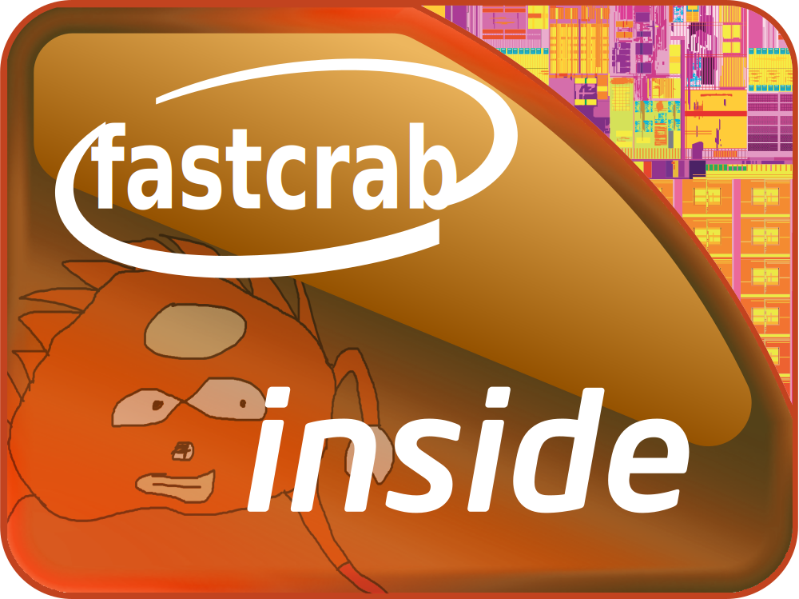

# IE Pass
IE Pass - The Console The Pass

<p align="center">
   <br/><br/>
   <a href="https://github.com/funmaker/iepass"></a>
</p>

## Usage

Install binary dependencies:
```bash
$ cargo install cargo-make espup ldproxy
$ espup install --targets=esp32,esp32s2,esp32s3
```
Also check ESP-IDF [platform specific dependencies](https://docs.espressif.com/projects/rust/book/installation/std-requirements.html). 

Build:
```bash
$ cargo make build
```

Run Tests:
```bash
$ cargo make test
```

Build and flash:
```bash
$ cargo make flash
```
