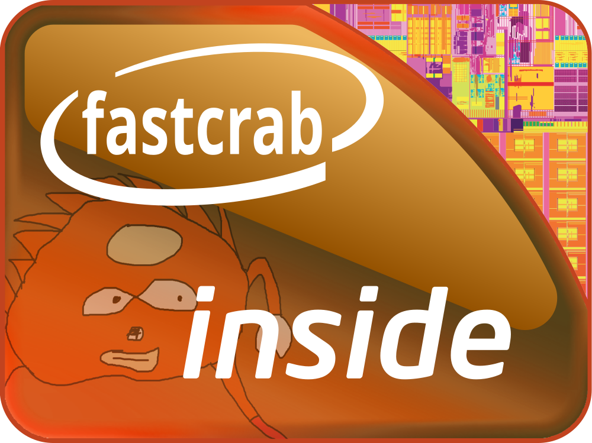

# IE Pass
IE Pass - The Console The Pass

<p align="center">
   <br/><br/>
   <a href="https://github.com/funmaker/iepass"></a>
</p>

## Usage

### Setup

1) Install [FFmpeg](https://ffmpeg.org/download.html).
2) Install cargo dependencies:
    ```bash
    cargo install cargo-make ldproxy espflash
    cargo install espup probe-rs-tools --locked
    espup install --targets=esp32s3
    ```

### Build:
```bash
$ cargo make build
```

### Run Tests:
```bash
$ cargo make test
```

### Build and flash:
```bash
$ cargo make flash
```
